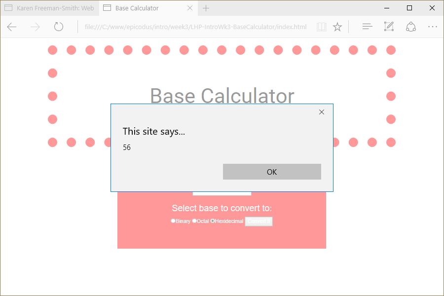

# [Base Convergter](http://karenfreemansmith.github.io/basecalculator)

__Version 1: April 18, 2016__
## by [Karen Freeman-Smith](http://karenfreemansmith.github.io)

### Description
__*A blank website with basic files setup for starting new projects with local Bootstrap and jQuery files linked.*__

Decimal is the normal system we use for counting. We start at 0, increment until we reach 9, and then reset back to 0 and add another number to the left.

In binary, we also start at zero, but we only increment until we reach 1. Then we reset back to zero and add another number to the left.

# Base Calculator
Version 0.0.1: April 18, 2016
by [Karen Freeman-Smith](https://karenfreemansmith.github.io)

### Technologies Used
HTML, CSS, Bootstrap, JavaScript, jQuery

## Description
*[Learn How To Program](http://learnhowtoprogram.com) Intro to Programming Week 3 Individual Project: A website to provide voter information based on age. If they are a first time voter, there is a survey to see what party they would best fit in.*

## Setup/Installation
* [View on Github Pages](https://karenfreemansmith.github.io/LHP-IntroWk3-BaseCalculator)
* _OR_
* Clone directory
* Open index.html in your favorite browser

## Support & Contact
For questions, concerns, or suggestions please email karenfreemansmith@gmail.com

## Specifications
* Write a method to convert numbers from decimal to binary.
* Write a method to convert numbers from decimal to octal.
* Write a method to convert numbers from decimal to hexadecimal.

## Known Issues
* None

## Legal
*Licensed under the GNU General Public License v3.0*

Copyright (c) 2016 Copyright _[Karen Freeman-Smith](https://karenfreemansmith.github.io)_ All Rights Reserved.
